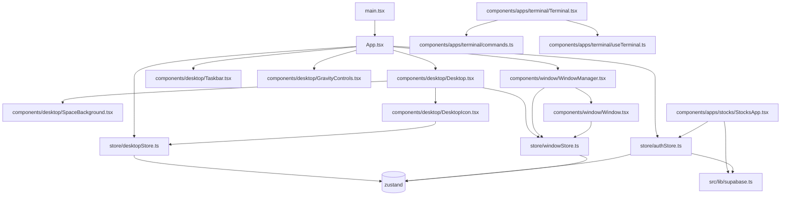

# Technical Design Document

## Overview
This document provides a high-level technical overview of the codebase, its architecture, main modules, data flow, and key design decisions. It is intended to help new developers and maintainers quickly understand the structure and interactions within the project.

---

## 1. Project Structure

```
index.html
package.json
postcss.config.js
tailwind.config.js
tsconfig.json
vercel.json
vite.config.ts
scripts/
  seed-prices.js
src/
  App.tsx
  main.tsx
  vite-env.d.ts
  components/
    apps/
      stocks/StocksApp.tsx
      terminal/
        commands.ts
        Terminal.tsx
        useTerminal.ts
    desktop/
      Desktop.tsx
      DesktopIcon.tsx
      GravityControls.tsx
      SpaceBackground.tsx
      Taskbar.tsx
    window/
      Window.tsx
      WindowManager.tsx
  lib/
    supabase.ts
  store/
    authStore.ts
    desktopStore.ts
    windowStore.ts
  styles/
    globals.css
```

---

## 2. Main Modules & Responsibilities

### Entry Point
- **main.tsx**: Bootstraps the React application and renders `App.tsx`.

### Core Application
- **App.tsx**: Root component. Composes the main UI (Desktop, Taskbar, GravityControls, WindowManager) and connects to global stores.

### Desktop Environment
- **components/desktop/**: Contains UI and logic for the desktop-like environment.
  - `Desktop.tsx`: Main desktop area, manages icons and windows.
  - `DesktopIcon.tsx`: Represents an app icon on the desktop.
  - `Taskbar.tsx`: Taskbar UI.
  - `GravityControls.tsx`, `SpaceBackground.tsx`: Visual/UX enhancements.

### Window Management
- **components/window/**: Handles windowing system.
  - `WindowManager.tsx`: Manages open windows.
  - `Window.tsx`: Represents a single window instance.

### Applications
- **components/apps/**: Contains app modules.
  - `stocks/StocksApp.tsx`: Stock viewer app, fetches data from Supabase.
  - `terminal/`: Terminal emulator app.
    - `Terminal.tsx`: Terminal UI.
    - `commands.ts`: Command definitions and handlers.
    - `useTerminal.ts`: Terminal logic/hooks.

### State Management
- **store/**: Global state using Zustand.
  - `authStore.ts`: Authentication state, integrates with Supabase.
  - `desktopStore.ts`: Desktop state (icons, layout, etc).
  - `windowStore.ts`: Window state (open/closed, focus, etc).

### Backend Integration
- **lib/supabase.ts**: Supabase client setup and configuration.

### Styles
- **styles/globals.css**: Global CSS, includes Tailwind setup.

---

## 3. Data Flow & Interactions

- **main.tsx** → **App.tsx** → [Desktop, Taskbar, GravityControls, WindowManager]
- **App.tsx** connects to global stores (authStore, desktopStore).
- **Desktop.tsx** uses windowStore and desktopStore for state.
- **WindowManager.tsx** manages Window components, uses windowStore.
- **StocksApp.tsx** uses authStore for user info and supabase for data.
- **Terminal** uses commands and useTerminal for logic.
- All stores use Zustand for state management.
- Supabase is used for authentication and data storage.

---

## 4. Key Design Decisions

- **Component-Driven UI**: The UI is modular, with each app and desktop feature as a separate component.
- **Zustand for State**: Zustand is used for lightweight, scalable state management.
- **Supabase Integration**: Used for authentication and backend data, abstracted in `lib/supabase.ts`.
- **Vite for Tooling**: Fast build and dev environment.
- **Tailwind CSS**: Utility-first styling for rapid UI development.

---

## 5. External Dependencies

- **React**: UI framework.
- **Zustand**: State management.
- **Supabase**: Backend as a service.
- **Vite**: Build tool.
- **Tailwind CSS**: Styling.

---

## 6. Architecture Diagram

See the Mermaid diagram below for a high-level view of module interactions:



---

## 7. Future Improvements
- Add more detailed docs for each app/module.
- Automate diagram generation for large codebases.
- Add tests and CI/CD documentation.

---

## 8. References
- [Supabase Docs](https://supabase.com/docs)
- [Zustand Docs](https://docs.pmnd.rs/zustand/getting-started/introduction)
- [Vite Docs](https://vitejs.dev/)
- [Tailwind CSS Docs](https://tailwindcss.com/docs)

---

_Last updated: May 8, 2026_
